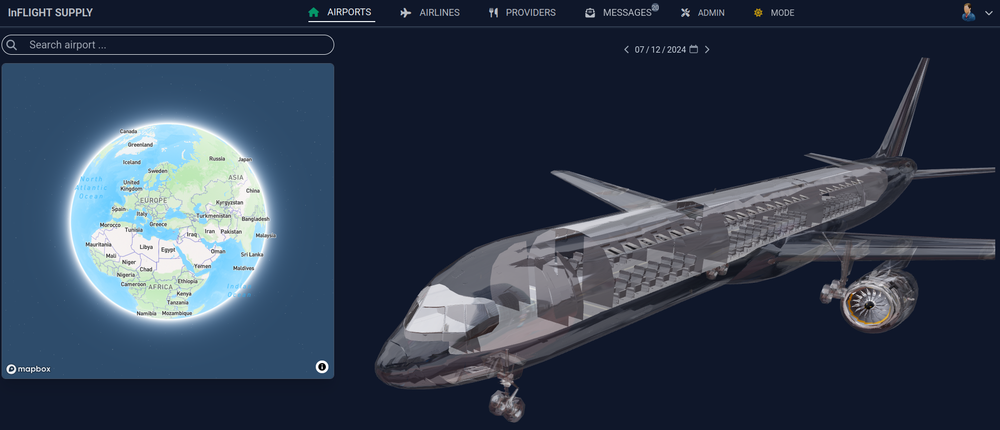
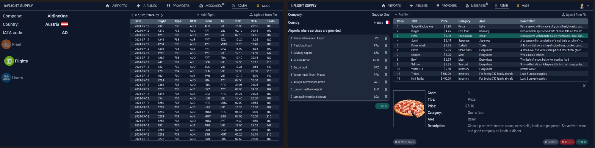
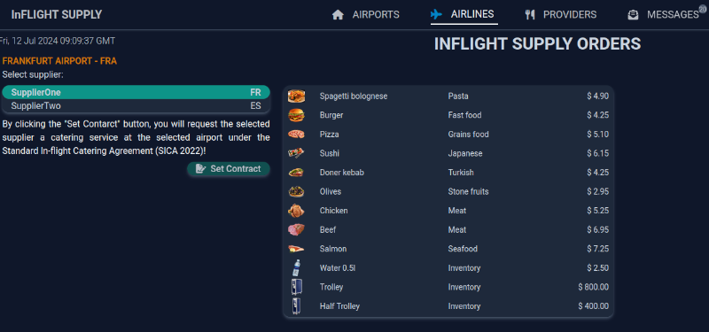
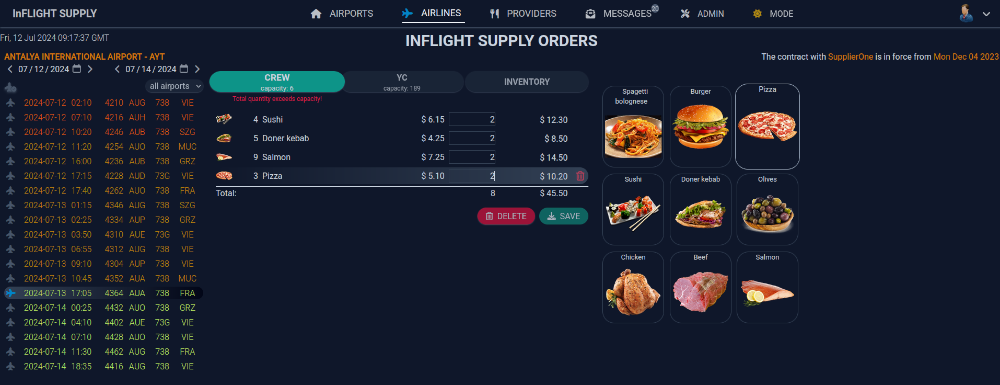

# Airline-Caterer Collaboration System

## Overview

Imagine you work for a commercial airline and have just developed a new flight schedule for the next month or year. The next step is to arrange handling services at the respective airports. Typically, this process involves spending significant time and resources to identify suitable handlers and caterers at these airports, conducting business trips to evaluate options and quality, and finally entering into contracts.

This project aims to streamline and facilitate the collaboration between airlines and handlers/caterers at airports where their operations intersect. While the design is ambitious and complex, it is based on a conceptual prototype that can be further developed into a functional system with the right support and investment.

## Functionality

All functionalities are accessible to registered users who can have roles such as admin, supervisor, or staff within their respective companies. The companies involved can be airlines or handlers/caterers.

## Additional Features

- **Interactive Model**: Before selecting an airport, users can view and manipulate a glass model of a Boeing 757 using their mouse.
- **Mobile Adaptation**: The site is adapted for mobile devices, although this feature is currently disabled.

## Testing and Familiarization

For the purpose of familiarization and testing, the site includes two registered airlines and two catering companies, each with their respective employees and data. These companies are fictional and have been created solely for testing purposes.

If you wish to explore or test the site, please contact the site author at **vsypko.dev@gmail.com**.

### Admin Page

On the admin page, company staff can upload relevant data:

- **Airline staff**: Upload their company fleet and flight schedule.
- **Caterer staff**: Enter the airports where they operate and details of meal sets and other in-flight consumption products.

### Service Intersection

An airport where an airline's schedule intersects with a caterer's business location becomes a potential service provision point. Contracts can be concluded for the provision of relevant services at these airports.

### Ordering and Fulfillment

- **Airlines**: Can place orders for specific meals and other supplies through the dedicated tab.
- **Suppliers**: Can receive and fulfill these orders.

While the prototype currently facilitates order placement and fulfillment, future enhancements will include integrated payment processing.

## Conclusion

This project leverages a unique UI approach, style, and concepts. As a prototype, it showcases the potential for a fully functional collaboration system that can significantly benefit stakeholders in the airline and catering industries. With adequate support and investment, this concept can be transformed into a viable and effective business solution. Not all tabs and features are fully developed yet, so this site is still a work in progress.
